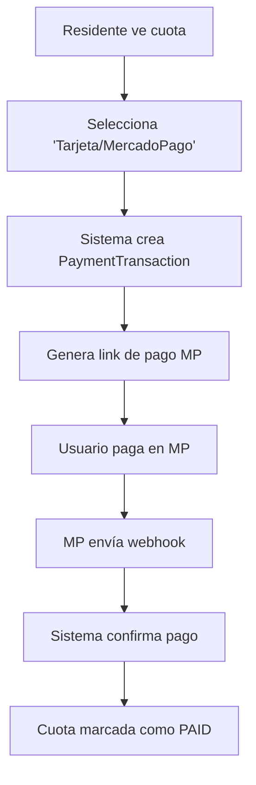
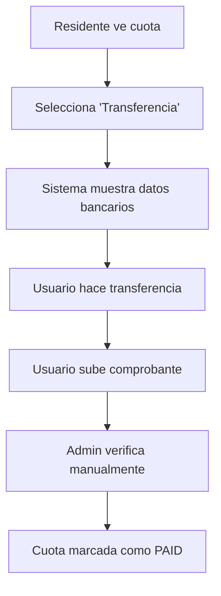
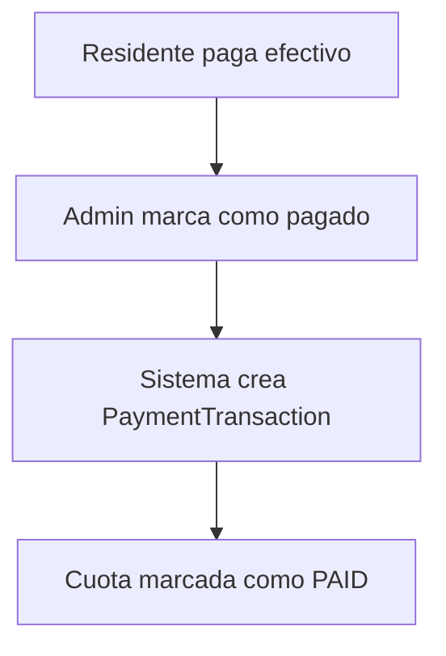

# 💳 Sistema de Pagos Actualizado - Arquitectura Completa

## 🎯 **Problema Identificado y Solución**

**PROBLEMA**: El modelo inicial `PaymentMethod` era muy básico y no soportaba pasarelas de pago reales con:
- Credenciales de API (Stripe, MercadoPago)
- Datos bancarios para transferencias
- Seguimiento de transacciones
- Confirmación automática de pagos

**SOLUCIÓN**: Arquitectura de 3 capas separando responsabilidades:

```
PaymentMethod     → Categorías generales (Efectivo, Tarjeta, etc.)
PaymentGateway    → Configuración de pasarelas reales  
PaymentTransaction → Registro de transacciones individuales
```

## 🏗️ **Nueva Arquitectura**

### **1. PaymentMethod** - Tipos de Pago
```python
# ✅ Solo categorías generales
PaymentMethod:
├── name: "Efectivo", "Transferencia", "Tarjeta"
├── requires_gateway: Boolean (si necesita pasarela)
├── manual_verification: Boolean (si requiere verificación admin)
└── description: Texto descriptivo
```

**Ejemplos**:
- ✅ "Efectivo" → `requires_gateway=False, manual_verification=True`
- ✅ "Transferencia" → `requires_gateway=True, manual_verification=True` 
- ✅ "Tarjeta" → `requires_gateway=True, manual_verification=False`

### **2. PaymentGateway** - Configuración Real
```python
# ✅ Configuración específica de cada pasarela
PaymentGateway:
├── name: "MercadoPago Test", "Stripe Prod", "Banco Nacional"
├── gateway_type: "mercadopago", "stripe", "bank_transfer"
├── config_data: JSON con credenciales y configuración
├── bank_info: JSON con datos bancarios (transferencias)
├── is_test_mode: Boolean (sandbox vs producción)
└── is_active: Boolean
```

**Ejemplos**:
```json
// MercadoPago
{
  "config_data": {
    "access_token": "TEST-1234567890-XXXXXX",
    "webhook_url": "https://tudominio.com/webhooks/mp/"
  }
}

// Transferencia Bancaria  
{
  "bank_info": {
    "bank_name": "Banco Nacional",
    "account_number": "1234567890",
    "holder_name": "Condominio Las Flores"
  }
}
```

### **3. PaymentTransaction** - Registro de Pagos
```python
# ✅ Seguimiento completo de cada transacción
PaymentTransaction:
├── quote: ForeignKey a la cuota pagada
├── payment_gateway: Pasarela utilizada
├── transaction_id: ID único interno
├── external_id: ID de la pasarela externa
├── amount: Monto procesado
├── status: "pending", "approved", "rejected"
├── gateway_response: JSON con respuesta completa
└── payment_details: Detalles adicionales
```

## 🚀 **Flujo de Pago Completo**

### **Flujo 1: Pago con MercadoPago**


### **Flujo 2: Transferencia Bancaria**


### **Flujo 3: Pago en Efectivo**


## 🛠️ **Implementación Práctica**

### **Paso 1: Instalar Dependencias**
```bash
pip install mercadopago  # Para MercadoPago
pip install stripe       # Para Stripe (opcional)
```

### **Paso 2: Configuración Inicial**
```bash
cd condominium_backend
python manage.py shell
>>> from quote.setup_payments import run_setup
>>> run_setup()
```

### **Paso 3: Configurar Pasarela Real**
```python
# En Django Admin o shell:
gateway = PaymentGateway.objects.get(gateway_type='mercadopago')
gateway.config_data = {
    'access_token': 'TU_ACCESS_TOKEN_REAL',
    'webhook_url': 'https://tudominio.com/api/quote/webhooks/mp/',
    'success_url': 'https://tuapp.com/payment/success'
}
gateway.is_active = True
gateway.save()
```

### **Paso 4: Crear Link de Pago**
```python
from quote.mercadopago_service import MercadoPagoService

# En tu view:
mp_service = MercadoPagoService()
result = mp_service.create_payment_link(
    quote=mi_cuota,
    payer_email="usuario@example.com"
)

# Result contiene:
{
    'payment_url': 'https://mercadopago.com/checkout/...',
    'transaction_id': 'MP_123_20241024_1430',
    'expires_at': '2024-12-31T23:59:59'
}
```

## 💰 **¿Cómo Recibir Dinero Real?**

### **MercadoPago** (Recomendado LATAM)
```python
# 1. Crear cuenta en mercadopago.com
# 2. Obtener credenciales reales (no TEST)
# 3. Configurar webhook: https://tudominio.com/webhooks/mp/
# 4. El dinero llega directo a tu cuenta MP
```

### **Stripe** (Global)
```python
# 1. Crear cuenta en stripe.com
# 2. Obtener keys reales (no test)
# 3. Configurar webhooks
# 4. El dinero llega a tu cuenta Stripe → banco
```

### **Transferencia Bancaria** (Más Simple)
```python
# Solo necesitas:
bank_info = {
    "bank_name": "Tu Banco",
    "account_number": "1234567890", 
    "holder_name": "Condominio Las Flores",
    "rut": "12.345.678-9"
}
# El residente ve estos datos y transfiere directo
```

## 🧪 **Testing en Modo Sandbox**

### **MercadoPago Testing**
```python
# Credenciales de prueba (gratis):
ACCESS_TOKEN = "TEST-1234567890-XXXXXX-XXXXXX"

# Tarjetas de prueba:
VISA_APROBADA = "4509 9535 6623 3704"
MASTERCARD_RECHAZADA = "5031 7557 3453 0604"

# Sandbox URL: https://sandbox.mercadopago.com
```

### **Stripe Testing**
```python
# Keys de prueba (gratis):
PUBLISHABLE_KEY = "pk_test_XXXXXXXXXXXXXXXX"
SECRET_KEY = "sk_test_XXXXXXXXXXXXXXXX"

# Tarjetas de prueba:
VISA_SUCCESS = "4242424242424242"
VISA_DECLINE = "4000000000000002"
```

## 📊 **APIs Disponibles**

```
# Crear link de pago
POST /api/quote/payments/create-link/
{
    "quote_id": 1,
    "gateway_type": "mercadopago",
    "payer_email": "user@example.com"
}

# Webhook de confirmación
POST /api/quote/webhooks/mercadopago/
# (MercadoPago llama automáticamente)

# Ver transacciones
GET /api/quote/transactions/?quote_id=1

# Verificar pago manual
POST /api/quote/payments/verify-manual/
{
    "quote_id": 1,
    "payment_reference": "Transferencia_123456",
    "payment_proof": "base64_image"
}
```

## ✅ **Ventajas de Esta Arquitectura**

### **🔒 Seguridad**
- Credenciales encriptadas en base de datos
- Separación entre test y producción
- Webhooks para confirmación automática

### **💪 Escalabilidad**
- Fácil agregar nuevas pasarelas
- Soporte para múltiples monedas
- Configuración por entorno

### **🎯 Simplicidad**
- Admin puede configurar todo desde Django Admin
- Residentes solo ven opciones activas
- Fallback manual siempre disponible

### **📈 Auditabilidad**
- Registro completo de cada transacción
- Estados intermedios guardados
- Respuestas de pasarelas almacenadas

## 🎉 **Estado Actual**

✅ **Modelos actualizados** con arquitectura completa
✅ **Scripts de configuración** listos
✅ **Ejemplo de MercadoPago** funcional
✅ **Documentación completa** 

## 🔜 **Próximos Pasos**

1. **Aplicar migraciones** para crear las tablas
2. **Configurar una pasarela real** (MercadoPago recomendado)
3. **Implementar webhooks** para confirmación automática  
4. **Testing con dinero real** en modo sandbox
5. **Integrar con frontend** React/Flutter

---

**💡 TIP**: Empezar con **transferencia bancaria** es lo más simple - solo necesitas mostrar tus datos de cuenta real y verificar manualmente los comprobantes. MercadoPago es el siguiente paso más fácil.